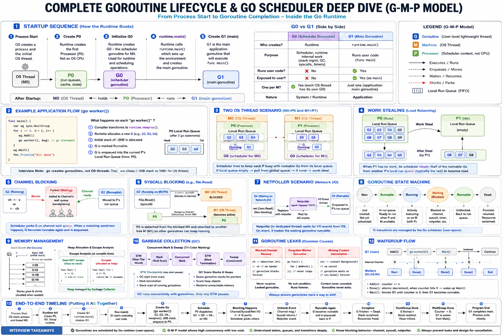

# Go Scheduler Internals (G-M-P Model)

> Deep dive into Go runtime scheduler internals, the G-M-P model, goroutine execution, work stealing, preemption, blocking syscalls, and scheduler performance optimization.

---

# Table of Contents

* [1. Introduction](#1-introduction)
* [2. Why Go Needed a Scheduler](#2-why-go-needed-a-scheduler)
* [3. The Problem with OS Threads](#3-the-problem-with-os-threads)
* [4. Go Runtime Scheduler Overview](#4-go-runtime-scheduler-overview)
* [5. Understanding the G-M-P Model](#5-understanding-the-g-m-p-model)

    * [5.1 Goroutine (G)](#51-goroutine-g)
    * [5.2 Machine (M)](#52-machine-m)
    * [5.3 Processor (P)](#53-processor-p)
* [6. Relationship Between G, M, and P](#6-relationship-between-g-m-and-p)
* [7. Goroutine Lifecycle](#7-goroutine-lifecycle)
* [8. Local Run Queues](#8-local-run-queues)
* [9. Global Run Queue](#9-global-run-queue)
* [10. Work Stealing](#10-work-stealing)
* [11. Blocking Syscalls](#11-blocking-syscalls)
* [12. Network Poller (Netpoller)](#12-network-poller-netpoller)
* [13. Scheduler Preemption](#13-scheduler-preemption)
* [14. Scheduler States](#14-scheduler-states)
* [15. Understanding GOMAXPROCS](#15-understanding-gomaxprocs)
* [16. Scheduler Flow Step-by-Step](#16-scheduler-flow-step-by-step)
* [17. Real Production Use Cases](#17-real-production-use-cases)
* [18. Hidden Performance Traps](#18-hidden-performance-traps)
* [19. Scheduler Tradeoffs](#19-scheduler-tradeoffs)
* [20. Production-Grade Example](#20-production-grade-example)
* [21. Performance Considerations](#21-performance-considerations)
* [22. GC and Scheduler Interaction](#22-gc-and-scheduler-interaction)
* [23. Common Interview Questions](#23-common-interview-questions)
* [24. Common Misconceptions](#24-common-misconceptions)
* [25. Key Takeaways](#25-key-takeaways)
* [26. Summary](#26-summary)

---

# 1. Introduction

The Go scheduler is one of the most important components of the Go runtime.

It enables Go applications to efficiently execute:

* millions of goroutines
* highly concurrent workloads
* large-scale network servers
* distributed systems

without creating millions of operating system threads.

Understanding the scheduler is critical for:

* performance optimization
* debugging concurrency issues
* understanding goroutine behavior
* designing scalable systems

---

# 2. Why Go Needed a Scheduler

Traditional thread-per-request systems do not scale efficiently.

OS threads are expensive because they involve:

* large memory stacks
* expensive context switching
* kernel scheduling overhead

If every request required a dedicated thread:

* memory usage would explode
* thread scheduling would become extremely expensive

Go solves this problem using:

* goroutines
* lightweight scheduling
* runtime multiplexing

---

# 3. The Problem with OS Threads

OS threads are:

* kernel-managed
* heavyweight
* expensive to create
* expensive to switch

Typical thread stack size:

* several MBs

Large-scale systems cannot efficiently support millions of threads.

---

# 4. Go Runtime Scheduler Overview

The Go runtime includes a user-space scheduler.

The scheduler is responsible for:

* goroutine execution
* work distribution
* balancing CPU utilization
* minimizing thread overhead

Go uses:

* many goroutines
* fewer OS threads

This enables massive concurrency.

---

# 5. Understanding the G-M-P Model

The Go scheduler is built around:

* G (Goroutine)
* M (Machine)
* P (Processor)

---

# 5.1 Goroutine (G)

A goroutine is a lightweight concurrent execution unit.

A goroutine contains:

* stack
* instruction pointer
* scheduling metadata
* execution state

---

# 5.2 Machine (M)

An M represents an operating system thread.

The OS schedules M onto CPU cores.

M executes Go code.

---

# 5.3 Processor (P)

P represents a logical processor required to execute Go code.

P contains:

* local run queue
* scheduler state
* memory allocation cache

Without a P:

* an M cannot execute Go code

---

# 6. Relationship Between G, M, and P

Execution flow:

```text id="kqg06g"
Goroutine (G)
      ↓
Machine / Thread (M)
      ↓
Processor Context (P)
      ↓
CPU Core
```

Relationship:

```text id="h2y0kr"
G runs on M
M requires P
```

---

# 7. Goroutine Lifecycle

Typical goroutine lifecycle:

```text id="qg5klx"
Created
   ↓
Runnable
   ↓
Running
   ↓
Blocked / Waiting
   ↓
Runnable Again
   ↓
Completed
```

Possible goroutine states:

| State    | Meaning               |
| -------- | --------------------- |
| Runnable | Waiting for execution |
| Running  | Currently executing   |
| Waiting  | Blocked               |
| Dead     | Finished              |

---

# 8. Local Run Queues

Each P has its own local run queue.

Benefits:

* reduced lock contention
* improved scalability
* better cache locality

Instead of one global queue, Go distributes work across processors.

---

# 9. Global Run Queue

Go also maintains a global run queue.

Used when:

* local queues overflow
* work redistribution is needed

The scheduler periodically checks the global queue.

---

# 10. Work Stealing

If one P becomes idle while another has many goroutines:

* idle P steals work

This improves:

* load balancing
* CPU utilization
* throughput

Work stealing is critical for scheduler scalability.

---

# 11. Blocking Syscalls

Suppose a goroutine performs a blocking syscall.

Potential issue:

* OS thread may block

Go solves this by:

* detaching P from blocked M
* attaching P to another available M

This prevents scheduler stalls.

---

# 12. Network Poller (Netpoller)

Go runtime includes a network poller.

Used for:

* sockets
* epoll
* kqueue
* IOCP

Instead of blocking threads:

* goroutines are parked
* threads are reused elsewhere

This allows Go to handle massive numbers of network connections efficiently.

---

# 13. Scheduler Preemption

Older Go versions had cooperative scheduling limitations.

Long-running goroutines could starve others.

Modern Go supports:

* asynchronous preemption

Benefits:

* fairness
* reduced latency
* better GC responsiveness

---

# 14. Scheduler States

The scheduler manages:

* runnable goroutines
* blocked goroutines
* executing goroutines

Transitions occur during:

* channel operations
* syscalls
* mutex waiting
* network I/O
* time.Sleep

---

# 15. Understanding GOMAXPROCS

`GOMAXPROCS` controls:

> maximum number of OS threads executing Go code simultaneously.

Example:

```go id="hgg0ew"
runtime.GOMAXPROCS(4)
```

Meaning:

* at most 4 goroutines execute in parallel

even if millions exist.

---

# 16. Scheduler Flow Step-by-Step

## Step 1

Goroutine created.

---

## Step 2

Placed into local run queue.

---

## Step 3

M attached to P executes goroutine.

---

## Step 4

If goroutine blocks:

* scheduler parks goroutine
* another runnable goroutine executes

---

## Step 5

Blocked goroutine becomes runnable again later.

---

# 17. Real Production Use Cases

## API Servers

Efficiently handle thousands of concurrent requests.

---

## Kafka Consumers

Parallel message processing using goroutines.

---

## WebSocket Servers

Support massive concurrent connections efficiently.

---

## Streaming Pipelines

Independent stages execute concurrently.

---

# 18. Hidden Performance Traps

## Unbounded Goroutines

Creating unlimited goroutines causes:

* memory growth
* scheduler overhead
* GC pressure

---

## CPU Saturation

Too many CPU-bound goroutines increase:

* context switching
* cache contention

---

## Blocking cgo Calls

Blocking C calls may bypass scheduler optimizations.

---

## Scheduler Starvation

Long-running goroutines may delay others.

---

# 19. Scheduler Tradeoffs

## Advantages

* lightweight concurrency
* efficient scheduling
* scalable I/O handling
* reduced thread overhead

---

## Costs

* scheduler complexity
* runtime overhead
* GC interaction
* non-deterministic execution

---

# 20. Production-Grade Example

```go id="mjlwmf"
package main

import (
	"fmt"
	"runtime"
	"sync"
)

func worker(id int, jobs <-chan int, wg *sync.WaitGroup) {
	defer wg.Done()

	for job := range jobs {
		fmt.Printf("Worker %d processing %d\n", id, job)
	}
}

func main() {
	runtime.GOMAXPROCS(runtime.NumCPU())

	jobs := make(chan int, 100)

	var wg sync.WaitGroup

	workers := runtime.NumCPU()

	for i := 0; i < workers; i++ {
		wg.Add(1)

		go worker(i, jobs, &wg)
	}

	for i := 0; i < 1000; i++ {
		jobs <- i
	}

	close(jobs)

	wg.Wait()
}
```

---

# 21. Performance Considerations

Scheduler overhead increases with:

* excessive goroutines
* heavy contention
* excessive blocking

Efficient systems use:

* bounded concurrency
* worker pools
* batching
* controlled scheduling pressure

---

# 22. GC and Scheduler Interaction

Garbage collector interacts closely with scheduler.

GC requires:

* stack scanning
* goroutine coordination
* scheduler synchronization

Scheduler design directly impacts GC latency.

---

# 23. Common Interview Questions

## Q1. Why does Go use the G-M-P model?

To efficiently multiplex goroutines onto threads while minimizing contention.

---

## Q2. Why does P exist?

To maintain local scheduler state and reduce global locking contention.

---

## Q3. What happens during blocking syscalls?

P detaches from blocked M and continues execution elsewhere.

---

## Q4. Why are goroutines lightweight?

Because they use:

* small dynamic stacks
* runtime scheduling
* user-space context switching

---

## Q5. What is work stealing?

Idle processors steal runnable goroutines from busy processors.

---

## Q6. What does GOMAXPROCS control?

Maximum parallel execution of Go code.

---

# 24. Common Misconceptions

## Misconception 1

> Goroutines are OS threads.

Incorrect.

Goroutines are runtime-managed execution units.

---

## Misconception 2

> More goroutines always improve performance.

Incorrect.

Too many goroutines can reduce performance.

---

## Misconception 3

> Blocking syscalls stop the scheduler.

Incorrect.

Go detaches processors and continues scheduling elsewhere.

---

# 25. Key Takeaways

* Go uses a user-space runtime scheduler.
* Scheduler is built around the G-M-P model.
* P contains local run queues and scheduler state.
* Work stealing improves load balancing.
* Blocking syscalls do not stop scheduler progress.
* Goroutines are lightweight compared to threads.
* Unbounded concurrency can hurt performance.
* Scheduler and GC are deeply connected.

---

# 26. Summary

The Go scheduler is one of the key reasons Go scales effectively for highly concurrent systems.

Understanding:

* G-M-P internals
* local queues
* work stealing
* blocking syscalls
* preemption
* scheduler tradeoffs

A strong Go engineer should be able to explain not only how goroutines are used, but how the runtime actually executes and manages them internally.



---
